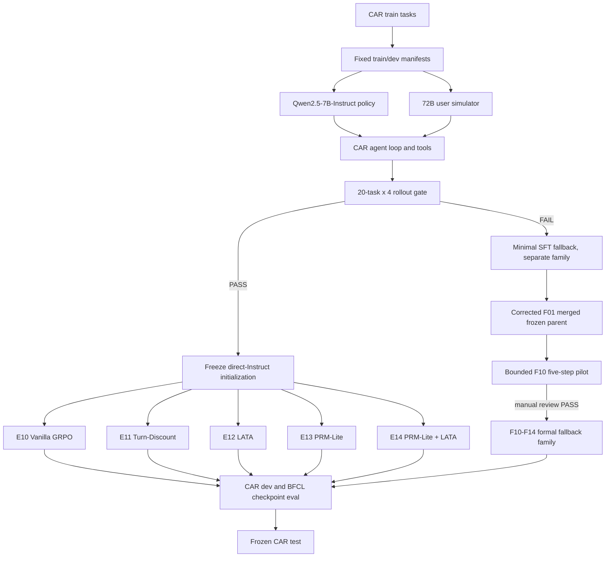

# Project.md: CabinAgent-RL

**Version**: v0.5 bounded fallback-GRPO pilot plan  
**Updated**: 2026-09-01  
**Goal**: 基于 CAR-bench 与 BFCL，比较 Direct-Instruct 与 Minimal-SFT fallback 初始化，并构建可复现的智能座舱多轮工具 Agent 训练、消融、评测与部署闭环。

## 1. 已确认边界

- Policy: `Qwen/Qwen2.5-7B-Instruct`；Direct E10-E14 保留为 gate FAIL 对照，fallback F10-F14 使用 corrected F01 合并后的同一冻结父模型并各自初始化新的 rank-32 LoRA。
- User simulator: `Qwen/Qwen2.5-72B-Instruct-AWQ`，由同一物理节点内独占一块 Pro 6000 的 vLLM 服务承担。
- RL framework: veRL 在线多轮 rollout；不使用 DPO，不把 API 模型放入训练热路径。
- Project-specific SFT: 不再是前置阶段，仅在真实 CAR rollout gate 失败时作为最小兜底，并建立独立实验族。
- Reward: CAR 最终状态、工具执行、自动规则与 PRM-Lite；训练 reward 不依赖 LLM policy evaluator。
- Compute: 一个 Slurm 作业在同一物理节点原子申请 2 块 Pro 6000；simulator 与 policy/trainer 各独占 1 GPU，禁止跨节点拼卡。
- Storage root: `/projects/jiatian001ssd/cabinagentrl/CabinAgent-RL`。
- 正式消融完整保留五组：Vanilla、Turn-Discount、LATA、PRM-Lite、PRM-Lite + LATA。

## 2. 主流程

训练用户数据由 72B simulator 根据 CAR train task 的 persona、instruction、当前对话和环境反馈动态生成。72B 在主流程中只扮演用户，不生成 reward、不训练，也不担任 policy evaluator。

## 3. 数据链路与隔离

| 数据 | 用途 | 隔离规则 |
|---|---|---|
| CAR train 约 103 task | rollout gate 与 GRPO task pool | policy 不可见隐藏 task/ground truth |
| CAR dev 约 26 task | 每 50 step 评测和 checkpoint 选择 | 不参与梯度更新 |
| CAR test 125 task | 最终一次冻结评测 | 不参与调参或提前停止 |
| BFCL V4 fixed subset | 工具调用格式与泛化评测 | 所有模型使用相同 manifest |

原始 CAR train 的 129 个 task 按 task type 分层、固定 seed 切成 train/dev，输出 task ID manifest。GRPO parquet 每行只负责启动任务，包含 `task_id`、task type、环境 seed、simulator seed、`agent_name` 和 server-side metadata；ground truth 不进入 policy prompt。

实现上，`scripts/build_carbench_parquet.py` 从完整 CAR train JSONL 生成固定 `103/26` train/dev 划分和 20-task gate parquet。parquet 明确排除 persona、instruction、actions 与 context state；`src/integrations/car_bench_runtime.py` 仅在环境侧按 `task_id` 恢复这些隐藏字段。

同一 GRPO group 的四条 rollout 共享初始环境和首条用户消息，保证 group-relative 比较成立。后续用户回复可随 policy 行为自然分叉。

## 4. 模型角色

| 角色 | 实现 | 是否训练 | 说明 |
|---|---|---|---|
| Policy/Actor | Qwen2.5-7B-Instruct + LoRA | 是 | E10-E14 各自新建 LoRA |
| Frozen reference | 相同 Qwen2.5-7B-Instruct revision | 否 | 用于 KL/reference 行为 |
| User simulator | Qwen2.5-72B-Instruct-AWQ | 否 | 固定模型、prompt 和采样协议 |
| Environment | CAR tools、state、terminal rules | 否 | 执行工具并产生 outcome |
| PRM-Lite | CAR deterministic rules | 否 | process score 裁剪到 `[-0.5, 0.5]` |
| Policy evaluator | 可选独立诊断 | 否 | 不进入训练 reward 或主 gate |

## 5. Direct-RL Rollout Gate

在正式 GRPO 前，用真实 7B policy、72B simulator 和 CAR agent loop 跑 20 个 train task，每个 task 采样 4 条，共至少 80 条 trajectory。

| 指标 | 通过阈值 |
|---|---:|
| tool-call parse rate | `>= 0.95` |
| executable tool rate | `>= 0.85` |
| mixed outcome group ratio | `>= 0.20` |
| consistent initial-user group ratio | `= 1.00` |
| loop 或 max-turn rate | `<= 0.20` |
| successful trajectories | `>= 1` |

Gate 使用 deterministic environment outcome，不使用 PRM-Lite。`configs/train/direct_rl_gate.yaml` 是阈值和 rollout 采样参数的单一来源；任一阈值不满足仍判为 FAIL，并输出 machine-readable report，不得静默放宽或改写历史结论。同一 group 的首轮 simulator 请求必须由 greedy sampling 生成且完全一致，后续 simulator turn 固定 `temperature=0.2`。这些阈值用于判断是否适合直接放大为正式 GRPO，不再被解释为禁止一切小规模诊断 RL；在明确记录科学风险并经人工批准后，可执行有界 pilot 来直接测量真实 optimizer 信号，但 pilot 不等于 gate PASS，也不自动解锁正式消融。

Gate PASS 后，E10-E14 的共同初始化固定为相同 Qwen2.5-7B-Instruct revision。Gate FAIL 时才允许运行 `configs/train/sft_fallback_lora.yaml`，只修工具格式和基础 CAR 交互；fallback 结果不能混入主 E10-E14，需建立 F10-F14 等独立对照。

Minimal-SFT fallback 使用 G00-G02 中 environment-success 的完整多轮轨迹，按 task 去重并互斥切分 train/val。Qwen2.5-7B-Instruct 以 LoRA rank 16、assistant-token-only loss 训练 1 epoch；先执行 2-step/4-record F00 smoke，成功后才运行完整 F01。每个 adapter、训练指标和 manifest 保存在独立 `sft_fallback_*` run 中。
当前 fallback 父模型固定为 corrected F01 `132942`：先在 GPU Slurm 作业中以 PEFT safe merge 合并回相同 Qwen2.5-7B 基座，生成带文件哈希 manifest 的不可变 snapshot，再由 F10-F14 从该 snapshot 分别新建 rank/alpha `32/32` RL LoRA。不得直接继续训练 F01 的 rank-16 adapter，也不得让分支之间继承 RL checkpoint。
数据 Slurm 阶段必须先用真实 Qwen tokenizer 验证样本数量与 32K 长度；该检查通过前不得申请 F00 GPU。
监督标签通过 Qwen `<|im_start|>assistant` 到 `<|im_end|>` token 边界从完整多轮会话提取，system/user/tool observation 均 mask 为 `-100`。
CPU tokenizer gate `131999` 已验证 38/14 个 train/val 样本全部可训练，最大长度 4309 token；F00 GPU smoke 可以启动。
F00 `132008` 已通过两步训练、验证和 adapter 保存。自动 F01 `132013` 因继承 smoke 的 `2-step/4-record` 环境变量而被判为无效 attempt；full 提交现显式覆盖为 `-1/-1`，下一 attempt 必须使用全部 38 条 train 记录。
F01 attempt 2 `132020` 已使用 38 条 train 完成 1 epoch/10 step，train/eval loss 为 `0.902976/0.584203`，峰值显存 `22.91 GiB`。但 G03 暴露出 SFT tool-call arguments 被 Qwen chat template 双重 JSON 编码；因此该 run 仅算训练基础设施完成，其 adapter 已从下游初始化候选中作废，必须修正数据后重训。
G03 attempt 1 `132043` 使用两块 Pro 6000，在 `gpu-pro6000-[1,7]` 运行 `6:10` 后因字符串 arguments 触发 CAR 自动规则 evaluator `TypeError`，没有生成 gate report。G03 固定 `POST_GATE_ACTION=none`；后续修复 attempt 即使 PASS 也只解锁 F10-F14，不会误触发或改写 E10-E14。

## 6. Reward 与优势估计

### 6.1 Outcome reward

`R_outcome` 由最终状态、任务完成、工具参数合法性、必要读取、能力边界、澄清结果和自动 policy rules 构成。模型只看到工具结果，不看到 ground truth 或 reward 内部字段。

### 6.2 PRM-Lite

- 扣分：非法工具/参数、无效重复、重复错误、必要检查前修改状态、自动 policy violation、虚构能力、未解决歧义、提前结束、超长轨迹。
- 加分：必要读取、正确澄清、能力边界意识、参数由观察支撑、错误恢复、最终状态正确且无污染、高效完成。
- `process_score = clip(sum(rule_events), -0.5, 0.5)`。
- E13/E14 使用 `R = R_outcome + 0.3 * process_score`；E10-E12 只使用 `R_outcome`。

### 6.3 五组正式消融

| ID | 实验 | Reward | Advantage |
|---|---|---|---|
| E10 | Vanilla GRPO | outcome | 标准 group-normalized GRPO |
| E11 | Turn-Discount | outcome | `w_t = alpha^(L-1-t)`，均值归一为 1 |
| E12 | LATA | outcome | Turn-Discount 后除以 `sqrt(L)` |
| E13 | PRM-Lite | outcome + process | 标准 GRPO |
| E14 | PRM-Lite + LATA | outcome + process | LATA |

默认 `alpha=1.05`、`process_weight=0.3`、`group_size=4`。所有主实验冻结这些参数，且不得互相继承 checkpoint。

## 7. 单节点双 GPU 运行拓扑

| 物理节点 | GPU step | 进程 | 职责 |
|---|---|---|---|
| 同一 highmem Pro 6000 节点 | 1x Pro 6000 96GB | vLLM | 72B-AWQ user simulator |
| 同一 highmem Pro 6000 节点 | 1x Pro 6000 96GB | policy vLLM 或 veRL actor/ref/rollout | 7B policy/GRPO LoRA |

Slurm 使用 `cluster02`、账户/QoS `msc`、`--nodes=1`、`--gres=gpu:pro6000:2`、`--constraint=highmem`。不显式设置内存或 CPU。一个 `srun` step 使用 `--ntasks=2 --gpus-per-task=1 --gpu-bind=single:1` 同时启动 simulator task 和 policy/trainer task，通过本机 `127.0.0.1` endpoint 通信，健康检查通过后才运行 rollout 或 trainer。两个 independent `srun --exclusive` step 会被集群串行化，禁止使用。

每个双 GPU 作业必须保存 Slurm stdout/stderr，以及 attempt 目录内的 allocation、simulator、policy/trainer、rollout 和 gate-check 日志。Allocation 日志记录物理节点、Slurm GPU 分配和 `nvidia-smi -L`，用于证明两块 GPU 位于同一节点并定位资源绑定问题。

Slurm 脚本显式通过 `bash` 调用仓库内 shell 入口，不依赖 Windows 同步包能否保留 Unix executable mode；signal trap 负责关闭 vLLM 子进程并释放 GPU。

所有计算节点进程统一 source `scripts/cluster_runtime_env.sh`，将 vLLM、TorchInductor、Triton、CUDA、FlashInfer、Hugging Face、Ray 和临时缓存定向到项目 SSD；`/home` 不承载训练/推理缓存。

Simulator 初始配置：AWQ-Marlin kernel、TP=1、`max_model_len=8192`、`max_num_seqs=16`、`max_num_batched_tokens=32768`、prefix caching、chunked prefill、显存利用率 0.92。vLLM 在 Pro6000 smoke 中明确确认 72B-AWQ 支持 Marlin；该选择只优化量化矩阵乘，不改变模型权重、prompt 或采样语义。只根据测量结果继续调整吞吐参数，不改变五组实验的 simulator 语义。

7B trainer 使用 veRL 0.9 async vLLM rollout、LoRA rank/alpha `32/32`、单卡 FSDP offload、4 task x 4 rollout/step、最大初始 prompt 24576 token 和累计 response 8192 token，总长度严格不超过 Qwen2.5-7B-Instruct 的 32768 context。`src/training/car_bench_agent_loop.py` 保持 token-in/token-out 轨迹，工具/用户 observation 的 token mask 为 0，并在 terminal 时直接写入 CAR deterministic reward，避免 reward adapter 丢失环境状态。环境一旦记录 hallucination/disambiguation terminal failure，simulator 不再发起额外模型请求。

## 8. 阶段计划

实验设置、逐次执行结果、已完成改进和遗留问题分别记录在独立阶段文档中：

| 阶段 | 文档 | 状态 |
|---|---|---|
| 01 | [基础与数据准备阶段](docs/实验阶段/01-基础与数据准备阶段.md) | 已完成 |
| 02 | [集群运行时与双模型部署阶段](docs/实验阶段/02-集群运行时与双模型部署阶段.md) | 已完成 |
| 03 | [Direct-RL 门禁阶段](docs/实验阶段/03-Direct-RL门禁阶段.md) | 已完成，结论为 FAIL |
| 04 | [Minimal-SFT 回退阶段](docs/实验阶段/04-Minimal-SFT回退阶段.md) | 已完成至 G04，F02 为负结果，F03 暂停 |
| 05 | [GRPO 消融训练阶段](docs/实验阶段/05-GRPO消融训练阶段.md) | 进行中，packed-path smoke PASS，待新 5-step F10 |
| 06 | [统一评测与报告阶段](docs/实验阶段/06-统一评测与报告阶段.md) | 未开始 |

统一入口见 [实验阶段总览](docs/实验阶段/实验阶段总览.md)。F02/G04 已作为负 corrective-SFT 结果归档，F03/G05 暂停；当前只授权 corrected-F01 初始化的 5-step F10 pilot，正式 F10-F14 仍等待 pilot 与恢复测试的人工验收。

## 9. 实验记录契约

每次 run 位于 `experiments/<run_id>/`，包含 `manifest.json`、冻结配置、日志、trajectory、checkpoints、逐 checkpoint eval、metrics 和 summary。Manifest 必须记录 base model revision/hash、数据 split、代码/config hash、seed、环境版本、Slurm job、节点和输出路径。

实施实验前必须依据 `AGENTS.md` 的“阶段映射 Map”加载 `Project.md`、`Progress.md`、实验阶段总览和对应的 `xxx阶段.md`。每个 attempt 完成、失败、中断或被判无效后，必须先在对应阶段文档分别追加“实验设置、执行结果、改进原因、改进措施”，再提交下一 attempt；同时同步 `Progress.md`、实验 tracker，以及发生阶段状态或路线变化时的本文件和总览。

实际提交训练时若目标 run 目录已存在，提交器必须创建 `_rN` attempt 目录，不覆盖或复用旧 manifest。Slurm 作业在 submitted、running、completed/failed 阶段原子更新 manifest 的 job ID、节点和状态；中断信号统一转为失败状态，失败 attempt 原样保留。生命周期元数据变换保持 source/config hash 等复现字段不变。

公开 Git 仓库为 `https://github.com/Jarod-Leo/CabinAgent-RL`，使用 `main` 分支，只保存源码、配置、可复现实验文档、测试与精选小型报告；模型、环境、checkpoints、正式 experiments、官方/派生数据、缓存和部署传输包通过 `.gitignore` 排除。仓库文本通过 `.gitattributes` 统一为 LF，保证 Linux shell/Slurm 可执行性。README 必须同步真实阶段状态与未完成边界。任何公开提交前必须完成敏感信息与大文件扫描，集群用户名、主机、密码、密钥和令牌不得进入 commit。阶段取得已记录且已验证的成功后，先同步阶段文档，再提交并推送对应 Git commit；失败 attempt 继续记录，但不把失败伪装为阶段成功。首次公开快照 commit 为 `ad0d12c6cd7b155472bd9ae0c12b50977241ff94`，已验证与远端 `main` 一致。

## 10. 核心指标

| 类别 | 指标 |
|---|---|
| CAR | success、consistent pass、final-state correctness |
| 工具 | parse/executable rate、tool/argument accuracy、invalid/redundant calls |
| 长程 | turns/tokens p50/p95、loop、recovery、max-turn rate |
| 边界 | hallucination、limit awareness、disambiguation、policy violation |
| RL | reward distribution、zero-variance group、KL、clip fraction、grad norm |
| 系统 | simulator throughput/latency、trainer wait、GPU memory、step time |

主结论以冻结独立评测为准，训练 reward 不能替代 CAR/BFCL 结果。

## 11. 当前门槛

- 已完成 Direct-RL 配置转换、真实 CAR runtime/agent-loop、parquet 生成器、rollout gate、五组优势/reward 和依赖式 Slurm 流水线。
- GPU 环境、7B/72B-AWQ 模型、CAR parquet、optimized simulator smoke 和 Direct-RL/fallback gates 已完成；G02、G03、G04 的合法 FAIL 结论全部保留，当前进入 corrected-F01 F10 有界 pilot 准备。
- `checkpoints/sft_lora` 空目录不是 checkpoint，也不再是正式训练前置条件。
- `scripts/submit_full_pipeline.sh` 只提交 QoS 允许的前五段 `afterok` 依赖；gate PASS 后由完成中的作业提交 2-step trainer smoke，此后每个成功训练阶段只提交下一组。Gate FAIL 或任一 trainer 失败时链条立即停止，且始终不超过 `msc` 的 5-job submit limit。
- G00 `131880` 已真实完成 80 条双模型 trajectory：parse `0.996667`、executable `0.989062`、success `27/80`、loop/max-turn `0.0125`，但 mixed outcome group ratio 仅 `0.10 < 0.20`。复核还发现 initial-user group consistency 为 `0.85`；因此训练未启动。
- G01 保持同一 20×4 数据、模型、reward 和全部阈值，只修复首轮 simulator 契约，并将 policy sampling 固定为 `temperature=1.0`、`top_p=0.95`、全局 seed `42` 派生逐 trial seed。G01 PASS 后自动进入 2-step E10 smoke；再次 FAIL 时执行独立的 minimal-SFT fallback，不放宽 gate。
- G01 attempt 1 (`131911`) 在模型加载前暴露并定位了继承 Conda 状态与 nested `bash -lc` 的 activation 冲突；它没有产生 rollout。Gate 与 trainer 脚本现统一显式初始化 Conda shell hook，attempt 2 将使用新 job ID 且保留 attempt 1 日志。
- G01 attempt 2 (`131930`) 完成 80 条 trajectory，mixed ratio 提升至 `0.15`，但 initial-user consistency 仍为 `0.85`，因此未启动训练。G02 使用按完整初始 prompt 哈希缓存的一次生成/同组复用机制落实 `1.0` 一致性；其他采样、数据、模型、reward 和 gate 阈值保持不变。若 G02 契约成立但 mixed ratio 仍 FAIL，则进入 minimal-SFT fallback。
- G02 `131950` 达到 initial-user consistency `1.0`，但 mixed reward group ratio 为 `0.0`；Direct-RL gate 因缺少有效组内优势信号正式 FAIL，E10-E14 保持阻塞。
- F00 `132008` 和 F01 attempt 2 `132020` 在单块 Pro 6000 上完成；G03 `132043` 在两块 Pro 6000 上失败。根因是 SFT tool-call arguments 双重 JSON 编码，而非 vLLM adapter 加载或 GPU 基础设施故障。旧 F01 adapter 已作废，下一步是修正数据、回归测试、重训 F01 并重跑 G03。
- Corrected 数据/tokenizer gate `132934`、F00 `132935` 和 F01 `132942` 已完成；真实 Qwen 模板验证 45/12 个 train/val tool calls 可 round-trip 为对象。单节点双 task smoke `132966` 在 `gpu-pro6000-3` 验证两个不同 GPU UUID。G03 `132967` 在 `gpu-pro6000-10` 完成 80 条 rollout，但 executable `0.844693`、mixed group `0.15` 和 loop/max-turn `0.2625` 未过冻结阈值，fallback gate 正式 FAIL，F10-F14 保持阻塞。
- 用户已授权并完成无效 job `132946` 清理。F02 保持相同 7B 基座与 LoRA 超参数，将 G00-G03 成功轨迹和七个 missing-tool family task 的直接拒绝/no-retry 纠正记录合并训练；G04 除 adapter 外保持 G03 gate 协议不变。
- F02 数据 job `133301` 生成 60/20 train/val records，真实 tokenizer 零跳过；smoke `133303` 与 full `133306` 均完成。完整 F02 train/eval loss 为 `1.088965/0.739128`。G04 `133308` 在 `gpu-pro6000-7` 使用同节点 2 块 Pro 6000 完成 80 条 rollout，但 executable `0.846829`、mixed `0.10`、loop/max-turn `0.275` 未过冻结门槛；F02/G04 作为负结果结束，F03/G05 暂停。
- 已批准 F10 bounded pilot：corrected F01 先合并成不可变父模型，F10 再挂载 fresh rank-32 RL LoRA；初始运行恰好到 optimizer step 5 并保存 checkpoint，独立 resume 作业至少再完成 step 6。必须至少有一个 step 同时出现非零 reward variance、非零 advantage、有限非零 gradient，且 KL/clip/grad norm 有限、无 NaN/OOM/reward-schema 错误；记录双 GPU 显存/利用率、step time 与等待开销。五步内不要求任务性能提升。
- Corrected F01 parent merge Slurm job `133431` 已在 `gpu-pro6000-4` 用 64 秒完成并生成约 15 GB snapshot 与 10-file hash manifest；全量哈希和模型/tokenizer load validation 通过前不得提交 F10。
- Parent validation 必须在计算节点重算精确文件集合、size 和 SHA-256，并完成 BF16 model/tokenizer load 与 one-token generation；输出 machine-readable PASS 后才满足 F10 初始化依赖。
- Validation attempt 1 job `133439` 因 standalone import path 缺陷在 artifact read 前失败，parent 未被修改；修复入口后必须新 Job ID 重试，不能把该 attempt 记为有效验证。
- Validation attempt 2 job `133447` 已 `PASS`：完整 10-file/15,242,726,337-byte hash inventory、BF16 7.616B model load、151,665 tokenizer 与 one-token generation 全通过；F10 parent dependency 已闭合。
- F10 five-step attempt 1 job `133456` 在 simulator health 后、veRL import 前因 launcher standalone `sys.path` 缺陷失败；0 steps、无 checkpoint，run 原样保留。修复并加强 dry-run import regression 后必须新 run/Job ID 重试，仍无 successor。
- Attempt 2 job `133478` 已越过 veRL/config validation，但 Ray plasma AF_UNIX socket 因 SSD 路径超过 107 bytes 失败；仍为 0 steps。仅把 Ray ephemeral session path 缩短到 Job-ID-scoped `/tmp` 后以新 run/Job ID 重试，持久产物路径与科学设置不变。
- F10 attempt 3 前先用 CPU Slurm job 实际验证短路径下的 `ray.init -> remote task -> shutdown`；该 preflight 未 PASS 时不得再次占用双 GPU。
- Ray CPU smoke job `133503` 已在 29 秒内 PASS（短 Job-ID tmpdir、remote task `42`、正常 shutdown），因此 F10 attempt 3 的运行时前置条件已满足。
- 基于 attempt 1/2 telemetry，simulator `0.92` 导致约 95.4% VRAM 占用；attempt 3 将该纯系统 cap 调为 `0.86` 以恢复约 10% headroom，保留 max seq 16。Policy/trainer `0.60` 等获得首次真实加载数据后再评估。
- F10 attempt 3 job `133512` 已越过 Ray init/config validation 并进入 remote TaskRunner，但环境缺少 veRL runtime module `transfer_queue`，0 steps。必须先核对官方来源/版本并用 Slurm import smoke 修复命名环境，不能猜测安装或直接重提双 GPU。
- 官方 veRL requirements 将缺失依赖固定为 `TransferQueue==0.1.7`；先通过 CPU Slurm 以 `--no-deps` 安装到项目命名环境，并验证 TransferQueue API 与 `TaskRunnerV1` 联合导入，PASS 后才允许 F10 attempt 4。
- TransferQueue repair attempt 1 job `133532` 已完成包安装和 veRL 联合导入，但 smoke checker 因 Ray `ActorClass` 无普通 `__name__` 而在报告写入前失败；修复 checker 后必须以新 CPU Job ID 获得正式 PASS。
- TransferQueue retry job `133541` 已正式 PASS：exact `0.1.7`、六个关键 API 与 `ActorClass(TaskRunnerV1)` 联合导入全部通过；F10 attempt 3 的依赖阻塞已闭合，允许全新 attempt 4。
- F10 attempt 4 job `133549` 越过 TransferQueue 和数据加载后，因 cluster02 同时导出 CUDA/ROCR visibility 被 veRL worker 主动拒绝，仍为 0 steps；先用单卡 Ray/veRL visibility smoke 验证仅保留 CUDA，再允许 attempt 5。
- 单卡 visibility job `133567` 已 PASS：原始 CUDA+ROCR 被安全规范为 CUDA-only，Ray GPU actor 与 veRL worker hook 均通过；允许 F10 attempt 5。
- F10 attempt 5 job `133581` 已通过 visibility 并进入 policy module build，但环境遗漏 veRL 默认 FlashAttention2；按官方 container pin 在单卡 Slurm force-build `flash_attn==2.8.3`（sm_120）并完成 kernel + exact parent smoke 后，才允许 attempt 6。
- FA2 install attempt `133600` 因 nvcc 12.8/Torch cu130 mismatch 在编译前失败且未安装；retry 使用集群 CUDA 13.0.0。正式 job 仅 trainer role 使用 CUDA 13，simulator role 保留 CUDA 12.8。
- FA2 retry `133615` 已 PASS：2.8.3 sm_120 wheel、BF16 前后向、exact F01 parent FlashAttention2 load/generate 全通过；允许 F10 attempt 6。
- F10 attempt 6 `133674` 已完整初始化并进入首个 rollout，但 Ray AgentLoop worker 缺 CAR dataset env，0 steps；先用 CPU Ray/OmegaConf smoke 验证 canonical root 传播，再允许 attempt 7。
- AgentLoop env smoke `133700` 已 PASS：Ray worker 中 canonical CAR root 存在，target/URL resolve 正确；允许 F10 attempt 7。
- F10 attempt 7 `133709` 已跑通完整初始化、初始验证和首批训练 rollout，但在 step 1 old-log-prob 的未分块全词表 entropy softmax 尝试额外分配 20.44 GiB 时 OOM；trainer 峰值 96,055/97,887 MiB，仍为 0/5 steps、无 checkpoint。下一 attempt 仅评估/启用数学等价的 chunked entropy 显存路径，科学设置与现有 caps 保持冻结。
- 已按 veRL 0.9 的真实 FSDP actor/ref 配置路径完成 chunked-entropy 修复准备：两侧均启用 `entropy_from_logits_with_chunking=true`、chunk size `2048`；本地 36 tests 与 compileall 通过。该变更只分块计算 softmax/entropy，不改变训练样本、有效 batch、reward、advantage 或优化器语义；远端解析验证通过后方可提交新 5-step attempt。
- F10 attempt 8 job `134671` 在通过远端 veRL 配置解析、36 tests、Bash syntax 与 Slurm test-only 后提交；run 为 `f10_pilot_20260901_stage18_r7`，初始状态为 `PENDING (Priority)`。资源仍为同节点 2x Pro 6000，target 5 steps，无 successor；排队/运行期间执行代码保持冻结。
- F10 attempt 8 `134671` 最终在 `gpu-pro6000-11` 运行 10m21s 后仍于 step 1 old-log-prob OOM，0/5 steps。根因已缩小为 veRL 0.9 dense-padding FSDP 分支忽略已解析的 chunking `True/2048`，仍调用未分块 entropy；推荐经确认后切换到原生支持 chunking 的 `use_remove_padding=True` packed 路径，并先做单 GPU集成 smoke。正式 F10-F14 与 step-6 resume 继续阻塞。
- 用户已确认该系统路径修复。Launcher 与 F10 submitter 现默认导出 `use_remove_padding=true`，新增单卡 packed-entropy smoke，验收 exact corrected-F01 parent、FA2、fresh rank-32/alpha-32 LoRA、veRL packed 分支契约、有限 entropy/log-prob 和有限非零 LoRA gradient；只有其 machine-readable JSON 为 PASS 才允许创建新的双卡 5-step attempt。
- 集群登录节点 API preflight 已确认 veRL 0.9 当前实现的 packed 输出方法归属 `FSDPEngineWithLMHead`，checker 已据此修正；该检查发生在 Slurm 提交前，不计作实验 attempt。
- Packed-path GPU smoke `135977` 已在远端 tests/dry-run/test-only 全通过后提交，当前 `PENDING (Priority)`；无自动 successor，JSON PASS 前不创建新的双卡 F10 run。
- Packed-path GPU smoke `135977` 已在 `gpu-pro6000-3` 运行 44 秒并 `PASS`：exact parent/FA2、fresh rank32 LoRA、有限 chunked entropy/log-prob、有限非零 gradient 均成立，峰值 reserved 约 15.05 GiB。单卡门禁闭合，允许创建新的 5-step F10 run；正式 F10-F14 仍等待 pilot 与 resume 人工验收。
- Pilot 只允许调整不改变实验语义的系统吞吐参数；group size、每步 task 数、有效 batch、sampling、长度/轮数、reward/advantage、LoRA、优化器/LR、数据和 simulator 全部冻结。初始目标保留约 10%-15% 动态显存余量，根据 telemetry 在 pilot/resume 边界人工调整，正式分支使用统一冻结设置。
- F10 pilot 与 step-6 resume 未实际通过前，不得宣称 fallback GRPO 闭环已跑通，也不得自动提交正式 F10-F14。若 F10 基础设施健康但 outcome advantage 全零，下一候选仅为独立 5-step F13 PRM-Lite pilot；只有 F13 仍无有效梯度时才讨论模型迁移，当前不展开。
